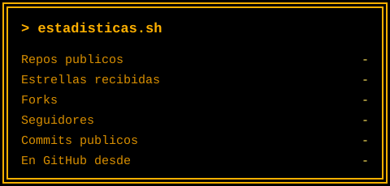
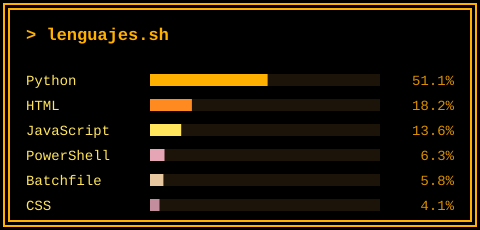

 

&nbsp;

---

## Sobre mí

Hola, soy **Juan** (AlbertiJ). Me estoy formando en ciberseguridad, en **Red Team** y **Blue Team**, y trabajo con **OSINT, CTF, APIs, bots y agentes de IA**. Uso Linux (Ubuntu) y administro proyectos web en un VPS.

Me focalizo en el **análisis de las fallas** que aparecen en la cotidianidad del trabajo y busco darles una **solución duradera**. Construyo herramientas para que el trabajo resulte más práctico y de mayor rendimiento, como si fuera una simbiosis entre profesional e IA. Las creo en base a los datos y a lo que veo en el campo de trabajo: mayor información, mejor resultado para resolver el problema. Un ejemplo: [vpn-prioridad](https://github.com/AlbertiJ/vpn-prioridad).

Mis compañeros ideales son **Claude Code, Gemini 4.0 y Grok**. Mi objetivo es convertirme en **ingeniero de IA** y de ciberseguridad.

- 🔭 **Aprendiendo:** Red Team y Blue Team, OSINT y CTF
- 🛠️ **Construyendo:** herramientas de red, APIs, bots y agentes de IA
- 🧠 **Método:** ver la falla → desglosarla → solución a largo plazo
- 🤝 **Abierto a colaborar** en proyectos de seguridad defensiva y de aprendizaje

*Fuera de la pantalla: proteccionista animal, carpintería y reciclado, tiro con arco.*

---

## Stack

<!-- Agregá acá las herramientas de seguridad que realmente uses (Wireshark, Burp Suite, Kali…). -->

---

## Proyectos destacados

| Proyecto | Qué hace | Stack |
|---|---|---|
| 🛡️ **[vpn-prioridad](https://github.com/AlbertiJ/vpn-prioridad)** | Da prioridad a la VPN en rutas y DNS, monitorea la conexión y genera un informe para el administrador. De un problema real a una herramienta, con ayuda de IA. | PowerShell · .bat · MIT |
| 📡 **[NetScanner](https://github.com/AlbertiJ/scanner)** | Escáner de red con interfaz de terminal, en español, para Windows y Linux: equipos, puertos, paquetes, tráfico y DNS. *Solo para redes propias o con autorización.* | Python · Textual · Scapy |
| 🧪 **[API Lab](https://github.com/AlbertiJ/crear-api)** | Entorno portátil para practicar reconocimiento y consumo de APIs REST con datos de pentesting y Linux, con 4 modos de juego (incluido 1 contra 1). | Python · Flask |
| 🔎 **[API Explorer](https://github.com/AlbertiJ/api)** | Mapea la estructura de una API, detecta datos sensibles, sigue la paginación y emite un informe firmado con SHA-256. | Python |
| 🤖 **[Plantillas de bots](https://github.com/AlbertiJ/Plantillas-de-bots)** | Panel de administración para bots de Telegram y Discord: lanzar, supervisar con watchdog y recuperar bots, con autenticación y Docker. | FastAPI · Python · Docker |
| 🗃️ **[Guardian de Obsidian](https://github.com/AlbertiJ/Guardian-Obsidian-Boveda)** | Demonio multiplataforma de bajo consumo que automatiza los WikiLinks y las etiquetas YAML de una bóveda de Obsidian. | Python · watchdog |
| 🎓 **[Claude Academia](https://github.com/AlbertiJ/academia_claude)** | Lecciones para aprender a usar Claude y a escribir buenos prompts, de 0 a avanzado, en una app web instalable. | HTML · JavaScript · PWA |
| 🤝 **[tetransfiero.com](https://tetransfiero.com)** | Proyecto social, **gratuito y sin publicidad**. | Proyecto social |

---

## Estadísticas

Se actualizan solas cada día con un workflow propio (solo repositorios públicos), sin servicios externos que se caigan.

---

## Contacto

- 💼 **LinkedIn:** [linkedin.com/in/alberti-juan](https://www.linkedin.com/in/alberti-juan/) · ahí comparto la mayoría de mis avances
- 🐙 **GitHub:** abrí un *issue* o un *pull request* en cualquiera de mis proyectos

Aprender atacando, para defender mejor.

